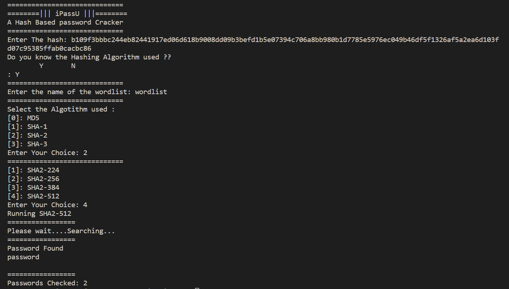

# iPassU
## A Hash-Based Password Cracker
### About the Project
A Hash-Based Password Cracker tool. Works on any word list.
Supports most of the commonly used hashing algorithms to store passwords
No dependencies needed, just python

**FEATURES**
 - Efficient
 - Easy-to-Use
 - Lightweight
- No Dependencies
- Wordlist Independent (default word list provided)

**ALGORITHMS SUPPORTED:**
 - MD5
 - SHA-1
 - SHA-2
	 - SHA2-224
	 - SHA2-256
	 - SHA2-348
	 - SHA2-512
- SHA-3
	- SHA3-224
	- SHA3-256
	- SHA3-348
	- SHA3-512

**Developer**
 - [Agnellus Fernandes ](https://www.linkedin.com/in/agnellus-fernandes-81232b192)
## Screenshots

***
**Tools used**  

 - Python3
